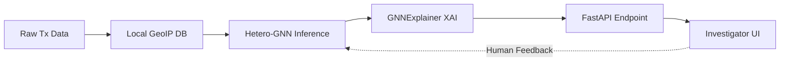

# Technical Write-Up: Crypto Anomaly Detection & Entity Correlation

> **Overview**
> This repository provides an offline, high-sensitivity cryptocurrency threat detection engine. It merges on-chain transaction data with off-chain network metadata into a deterministic graph, utilizing a Heterogeneous Graph Neural Network (Hetero-GNN) and automated XAI evidence generation to prioritize threats for forensic investigators.

---

## 1. Data Pipeline & Correlation Approach

**Ingestion & Feature Engineering**

The system ingests the Elliptic Bitcoin transaction dataset augmented with off-chain network metadata (transaction IDs, input/output amounts, fees, source/destination IPs, ports, and timestamps). Features are engineered across transaction, entity, network, and temporal dimensions to capture behavioral anomalies.

**Offline GeoIP & ASN Integration**

To guarantee compliance with air-gapped Linux environments, source and destination IP addresses are enriched locally using MaxMind `GeoLite2-City.mmdb` and `GeoLite2-ASN.mmdb` databases. This resolves network traffic into country, city, and ASN data fully offline without relying on external API calls.

**Correlation Logic (Deterministic Graph)**

Rather than relying on statistical or heuristic assumptions about IP ownership, the system deterministically links on-chain cryptocurrency transactions to off-chain network IP data before the model sees them. The foundational graph architecture is defined by the following schema:

$$\text{WalletAddress} \xrightarrow{\text{SPENT / RECEIVED}} \text{Transaction}$$

$$\text{WalletAddress} \xrightarrow{\text{BELONGS\_TO}} \text{MasterEntity}$$

$$\text{Transaction} \xrightarrow{\text{BROADCAST\_FROM}} \text{IPAddress} \xrightarrow{\text{LOCATED\_IN}} \text{Country}$$

---

## 2. Model Choice & Technical Architecture

**Selected Model**

The core detection engine is a **Heterogeneous Graph Neural Network (Hetero-GNN)** implemented via PyTorch Geometric. It processes transaction features through an encoder before applying a two-layer GraphSAGE (`SAGEConv`) network to aggregate spatial, structural, and network neighborhood embeddings prior to classification.

**Rationale**

A Hetero-GNN was selected over standard tabular ML baselines (like Random Forest or XGBoost) because cryptocurrency evasion tactics are inherently relational. By modeling the data as a relationship-rich graph encompassing multiple node types (`Transaction`, `WalletAddress`, `MasterEntity`, `IPAddress`, `Country`, `ASN`), the model leverages multi-hop structural context that isolated tabular rows miss entirely.

**Training & Metrics**

To rigorously evaluate real-world generalization, data is split **temporally** rather than randomly: Training (time steps 1–34), Validation (steps 35–41), and Testing (steps 42–49). Supervised training utilizes 42,019 licit and 4,545 illicit labeled transactions.

| Metric | Test Set Value | Operational Interpretation |
| --- | --- | --- |
| **Recall (Illicit)** | **0.85** | **High sensitivity:** Successfully captures 85% of malicious transactions. |
| **Precision (Illicit)** | **0.04** | Generates a significant false-positive rate (addressed via triage). |
| **F1-Score** | **0.07** | Reflects the extreme class imbalance of the dataset. |
| **PR-AUC** | **0.0462** | Primary benchmark metric utilized due to data imbalance. |
| **ROC-AUC** | **0.5004** | Baseline discrimination under strict temporal drift constraints. |

**Strategic Reframing: The Human-in-the-Loop Filter**

The model is deliberately tuned for **high recall (85%)** to ensure maximum threat containment. Rather than functioning as a standalone autonomous decider, the AI acts as an automated **risk-prioritization filter**. The resulting false positives are managed downstream by a Human-in-the-Loop workflow, allowing forensic investigators to make the final authoritative decisions.

---

## 3. Explainability Method (XAI) & Evidence

**Explainability Library**

To eliminate black-box opacity and provide actionable intelligence, the system employs **GNNExplainer**. This algorithm extracts target subgraphs and node feature masks that contribute most heavily to an elevated risk score.

**Evidence Generation**

The XAI engine converts raw probabilistic outputs into human-readable investigative evidence mapped directly to the dashboard. The dashboard flags entities based on:

- **Structural Graph Evidence:** Highlights suspicious connection chains (e.g., shared `MasterEntity` nodes or high-degree IP clusters).
- **Entity & Transaction Anomalies:** Flags abnormal fee ratios, sudden value spikes, or unusual temporal positioning.
- **Geographic Metadata:** Exposes the associated network origin (`src_ip`, `Country`, `ASN`).

---

## 4. System Integration & Offline Deployment

> [!IMPORTANT]
> **100% Offline Capability:** The entire pipeline executes fully offline on a Linux platform using pre-packaged local databases, satisfying strict security and air-gapping requirements.

**Linux Environment & Architecture**

The solution is fully containerized using Docker. The internal stack relies on Python, PyTorch Geometric, FastAPI, Scikit-learn, and local MaxMind MMDB files.



**Output Contract & Retraining Loop**

Inference results and extracted evidence are transmitted to the dashboard UI via a structured JSON REST endpoint. When an investigator reviews an alert, their manual decision (`CONFIRMED` or `FALSE_POSITIVE`) is logged to feedback storage, driving periodic offline model retraining to continually suppress false positives.

```json
{
  "txId": "tx_890213",
  "risk_score": 0.87,
  "risk_level": "HIGH",
  "prediction": "SUSPICIOUS",
  "evidence": [
    {
      "factor": "entity_activity",
      "importance": 0.31,
      "description": "Unusual entity-level transaction activity"
    },
    {
      "factor": "graph_structure",
      "importance": 0.24,
      "description": "Relevant connected graph pattern"
    }
  ]
}
```
